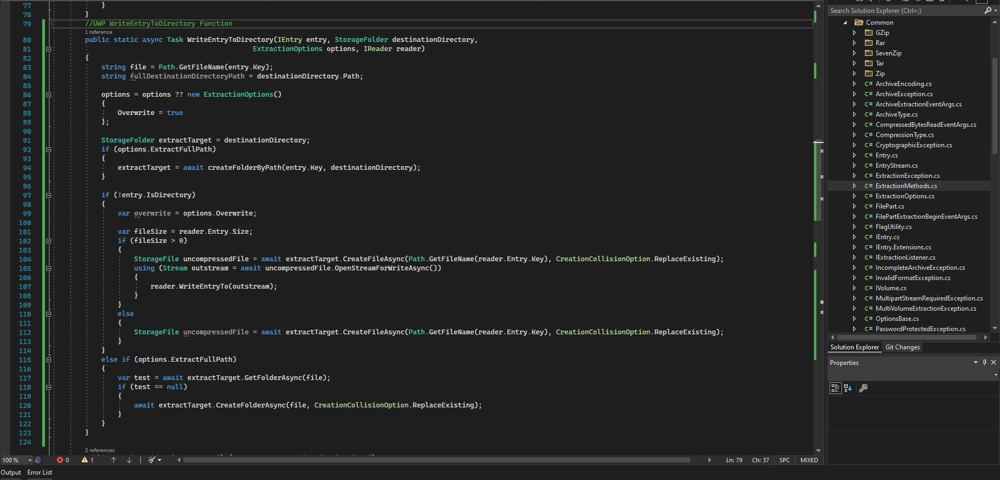

<p align="center">
  <br>
  <b>Universal compression library for UWP projects</b><br>
  <a href="./src">Source</a> |
  <a href="https://github.com/adamhathcock/sharpcompress">Original Project</a> 
  <br><br>
  <br><br>
</p>


# About

SharpCompress is a fully managed C# library to deal with many compression types and formats. 

The project originally developed by Adam Hathcock 

Based on the Original SharpCompress 0.30.1


# Current Progress

In progress, currently only two main functions ported

- [x] WriteEntryToDirectory

- [x] AddAllFromDirectory

- [ ] More functions in progress


# Target

It will support any UWP project (build 14393+)


# Usage

You will be able for now to compress or decompress with specific functions


## Compress

```csharp
var zipFile = await folder.CreateFileAsync("testFile.zip", CreationCollisionOption.ReplaceExisting);
using (var stream = await zipFile.OpenStreamForWriteAsync())
using (var archive = ZipArchive.Create())
{
  //To avoid UI block run this code into Task
  //Add all from directory can extended to:
  //AddAllFromDirectory(storageFolder, string[] searchPattern, SearchOption.AllDirectories, IProgress<int> progress, bool IncludeRootFolder)
  //IProgress<int> progress will report how many file queued
  await archive.AddAllFromDirectory(targetFolder);
  
  //Save to can extended to:
  //SaveTo(Stream stream, WriterOptions options, IProgress<Dictionary<string, long>> progress, CancellationTokenSource cancellationTokenSource)
  archive.SaveTo(stream);
}            

```


## Extract

```csharp
Stream zipStream = await zipFile.OpenStreamForReadAsync();
using (var zipArchive = ArchiveFactory.Open(zipStream)){
//It should support 7z, zip, rar, gz, tar
var reader = zipArchive.ExtractAllEntries();

//Bind progress event
reader.EntryExtractionProgress += (sender, e) =>
{
  var entryProgress = e.ReaderProgress.PercentageReadExact;
  var sizeProgress = e.ReaderProgress.BytesTransferred.ToFileSize();
};              

//Extract files
while (reader.MoveToNextEntry()){
  if (!reader.Entry.IsDirectory){
    await reader.WriteEntryToDirectory(destinationFolder, new ExtractionOptions() { ExtractFullPath = true, Overwrite = true });
  }
}
}

```


# Credits

Developed by Adam Hathcock 

UWP Port Bashar Astifan